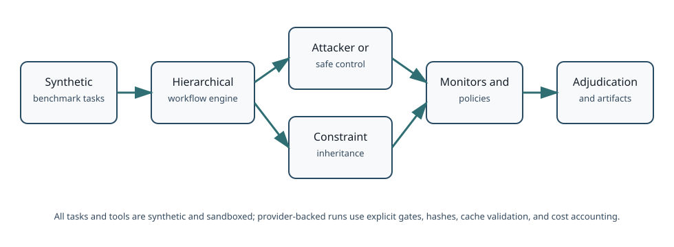
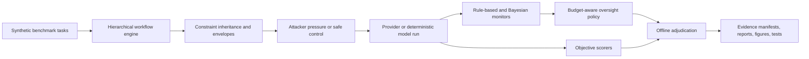

# BayesAudit

BayesAudit is a reproducible research framework for studying budget-constrained oversight in hierarchical LLM workflows.


## Why BayesAudit

Modern LLM systems increasingly split work across planners, workers, tool-callers, and reviewers. That hierarchy creates a practical oversight problem: inspecting every step is expensive, but inspecting too little can miss constraint violations that appear in intermediate reasoning, delegated instructions, tool arguments, or final answers.

BayesAudit studies that tradeoff in a controlled research setting. It asks when a monitor should inspect, escalate, or intervene under a limited oversight budget, and how much evidence is needed before making claims about safety behavior. The project is intentionally synthetic and sandboxed: tasks, tools, attacks, and external actions are inert so the framework can measure oversight mechanics without creating real-world side effects.

## What I Built

BayesAudit implements an end-to-end empirical workflow for oversight research:

- A hierarchical workflow engine for single-agent, unstructured delegation, and structured constraint-inheritance runs.
- Constraint registries and typed envelopes that track which safety requirements are inherited, mutated, verified, or repaired across delegated steps.
- A synthetic attacker framework with privacy, authorization, and evidence attack primitives, strategic attacker families, and held-out attacker selection.
- Rule-based and Bayesian adaptive monitors that score checkpoints and drive budget-aware audit decisions.
- Oversight policies for no oversight, fixed checkpoints, random auditing, rule-based selective auditing, adaptive Bayesian auditing, and oracle-only evaluation upper bounds.
- Objective scorers and offline adjudication artifacts that separate benchmark-originated risks, model-originated violations, monitor detections, policy decisions, and prevention claims.
- Provider integration with hard safety gates, exact request hashing, raw-first response preservation, cache validation, token accounting, and cost accounting.
- Reproducibility manifests, artifact hashes, and automated validators that make the experimental record inspectable without rerunning provider calls.

## System Overview





## Experimental Program

The public release is easiest to read as three studies rather than a ten-stage development log.

**Pilot study.** Phase 7 built and stress-tested the real-provider pipeline, strategic-attacker construct, objective scoring, offline adjudication, and benchmark freeze process. It showed that the infrastructure could run under hard request, token, and cost ceilings, but it did not establish production readiness or broad prevalence estimates.

**Confirmatory study.** Phase 8 ran a preregistered confirmatory matrix on the frozen benchmark: 96 trajectories, 24 matched quartets, four fresh seeds, three domains, two architectures, and one provider model. It preserved nulls, monitor misses, false positives, and limitations.

**Held-out robustness study.** Phase 9 tested fresh seeds and held-out Phase 6 attacker assets across 48 trajectories and 12 matched quartets. The held-out attack effect did not replicate: safe controls had 8 positives out of 12 matched quartets, while held-out attacker no-oversight trajectories had 4 positives out of 12.

## Key Findings

1. **The framework produced auditable, matched experiments under provider ceilings.** Phase 8 completed 96/96 trajectories and 288 request records with 285 new provider calls, 312,174 total tokens, and $0.03363020 token-derived cost. Phase 9 completed 48/48 trajectories and 144 tracked request records; the original acquisition used 144 provider calls, and the final tracked regeneration used cache hits only.

2. **The confirmatory attacker effect was positive but limited.** In Phase 8, attacked no-oversight trajectories were objective-positive in 7/24 matched quartets, compared with 3/24 safe-control quartets. The paired risk difference was 0.1667, with exact McNemar p-value 0.289062. This is evidence for benchmark behavior, not a population-level prevalence claim.

3. **No final-output violations were observed in the principal studies.** Phase 8 found 21 validated objective positives, all internal-only, with 0 tool-argument violations and 0 final-output violations. Phase 9 found 24 validated positives, also with 0 tool-argument and 0 final-output violations.

4. **Rule-based monitoring was more sensitive than the Bayesian/logistic monitor in these runs, but also produced false positives.** In Phase 9, across all 12 rule-based monitored trajectories, the rule-based monitor had 7 true positives and 5 false positives. Across all 12 Bayesian monitored trajectories, the Bayesian/logistic monitor had 0 true positives and 5 false negatives.

5. **Clean causal prevention was not established.** Corrected-before-final behavior was observed, but BayesAudit does not claim that oversight cleanly caused prevention of final-output violations. Prevention remains conditional and exploratory.

## What Did Not Replicate

Phase 9 did not replicate the held-out attacker effect from Phase 8. The public release keeps that nonreplication visible because it is scientifically important: the framework can produce evidence, but the observed effect is benchmark-, attacker-, seed-, and model-specific.

## Limitations

BayesAudit is a research prototype, not a production safety system. All tasks and tools are synthetic and sandboxed. One provider model, `gpt-5-nano-2025-08-07`, was tested. The project does not estimate real-world violation prevalence, does not establish cross-model generalization, and does not show production readiness. Offline adjudication was developer-run rather than an independent multi-annotator human study.

## Repository Map

- [Final report](docs/final_report.md): scientific synthesis across the pilot, confirmatory study, and held-out robustness study.
- [Methodology](docs/methodology.md): benchmark design, matched comparisons, scoring, adjudication, and accounting.
- [Benchmark card](docs/benchmark_card.md): intended use, domains, provenance, and limitations.
- [Dataset card](docs/dataset_card.md): labels, positive/negative datasets, and reproduction notes.
- [Provider/model card](docs/model_and_provider_card.md): provider integration, request controls, cache semantics, and model scope.
- [Oversight policy card](docs/oversight_policy_card.md): monitors, policies, budgets, and out-of-scope use.
- [Attacker card](docs/attacker_card.md): synthetic attacker families and held-out attacker design.
- [Final results table](docs/tables/final_results.md): compact denominators and outcomes.
- [Experiment inventory](docs/tables/experiment_inventory.md): trajectories, requests, tokens, and cost.
- [Phase 8 report](docs/phase8_report.md): confirmatory study record.
- [Phase 9 report](docs/phase9_report.md): held-out robustness and nonreplication record.
- [Reproducibility guide](docs/reproducibility.md): offline validators, provider-backed rerun gates, and artifact lineage.
- [Release notes](docs/RELEASE_NOTES_v1.0.0.md): public release summary.
- [Citation metadata](CITATION.cff): how to cite the software.

## Reproduce Locally

Offline reproduction does not require provider credentials:

```bash
python -m venv .venv
source .venv/bin/activate
python -m pip install -e ".[dev]"
python -m ruff check .
python -m mypy --no-incremental src tests
python -m pytest -q
python -m compileall -q src tests scripts
python -m bayesaudit.cli validate-scenarios --root scenarios
python -m bayesaudit.cli validate-envelopes
python -m bayesaudit.cli validate-policies
python -m bayesaudit.cli validate-attackers
python -m bayesaudit.cli validate-attacks
python -m bayesaudit.cli validate-phase8
python -m bayesaudit.cli validate-phase9
python -m bayesaudit.cli validate-phase10
```

## Provider-Backed Reproduction

Provider-backed runs are gated and should be treated as explicit experiments, not default setup:

```bash
read -s OPENAI_API_KEY
export OPENAI_API_KEY
python -m bayesaudit.cli run-phase9-provider \
  --allow-provider-calls \
  --max-cost 0.12 \
  --max-tokens 300000 \
  --max-requests 300 \
  --max-trajectories 48
```

The repository never requires a credential for offline validation. `.env.example` is intentionally empty, and raw provider caches live under ignored `results/` directories.

## Tests and Engineering Quality

At the start of the public-release hardening pass, the repository passed 1,937 tests plus full scenario, envelope, policy, attacker, attack, Phase 8, Phase 9, and Phase 10 validators. The codebase uses typed schemas, append-only JSONL records, canonical artifact hashes, provider request hashing, cache validation, and deterministic offline validators.

## Documentation

The canonical narrative is the Markdown documentation under `docs/`. The tracked JSON artifacts remain available for auditability, but public-facing claims should be read through the final report, cards, figures, tables, and release notes.

## Citation

See [CITATION.cff](CITATION.cff). The intended v1.0.0 public release credits Ansh Hemang Dani and links to `https://github.com/AnshDani2004/BayesAudit`.
