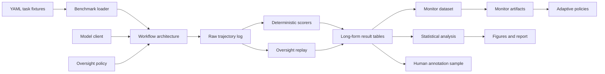

# Proposed Architecture

## Package Boundaries

`bayesaudit.schemas`

Defines Pydantic records for tasks, constraints, trajectory steps, audit decisions, violations, scores, and monitor estimates. These schemas are the stable contract between generation, execution, scoring, storage, and analysis.

`bayesaudit.interfaces`

Defines Protocol interfaces for model clients, workflow architectures, oversight policies, scorers, and monitors.

`bayesaudit.benchmark`

Loads and validates benchmark tasks. Scenario hashes are computed from canonical fixture content during loading. Controlled parameterized generation remains deferred.

`bayesaudit.architectures`

Contains the single-agent workflow, unstructured deterministic planner-worker hierarchy, structured inheritance workflow, and verified inheritance workflow.

`bayesaudit.oversight`

Contains Phase 4 checkpoint extraction, redacted observation construction, deterministic audit mechanisms, budget ledgers, no-oversight, random, fixed-checkpoint, rule-based, and evaluation-only oracle policies, replay logic, matching, metrics, and counterfactual helpers.

`bayesaudit.monitoring`

Contains Phase 5 monitor datasets, interpretable feature extraction, grouped splits, local monitor baselines, calibration, abstention, OOD diagnostics, mock LLM-judge monitoring, evaluation metrics, and model cards.

`bayesaudit.adaptive`

Contains Phase 5 Bayesian risk states and budget-aware adaptive allocation policies.

`bayesaudit.providers`

Contains provider cost manifests and hard safety gates for any future real-model pilot.

`bayesaudit.attackers`

Contains Phase 6 attack schemas, attacker observations, synthetic primitives, stateful attacker policies, attacker-defender lifecycle helpers, and restricted empirical-game analysis.

`bayesaudit.pilot`

Contains Phase 7 real-pilot schemas, provider authorization records, cost plans, prompt renderers, request caches, request ledgers, structured-output parsing, workflow-quality flags, annotation samples, monitor/calibration/OOD transfer helpers, readiness classification, freeze-proposal generation, and Phase 8 planning scaffolds. Real-provider adapters are modular but disabled by default.

`bayesaudit.scoring`

Contains deterministic Phase 2 scorers for evidence, privacy, budgeting, authorization, and protected-attribute exclusion.

`bayesaudit.constraints`

Contains canonical registries, typed envelopes, deterministic mutation application, envelope comparison, verification, repair, and retention metrics.

`bayesaudit.storage`

Persists append-only raw JSONL trajectories/scores and normalized Parquet tables, including Phase 3 inheritance artifact tables. DuckDB can consume the Parquet outputs but is not required for tests.

`bayesaudit.statistics`

Will fit confirmatory and exploratory models, including hierarchical logistic regression, bootstrap intervals, calibration metrics, and sensitivity analyses.

`bayesaudit.visualization`

Will produce safety-reward-cost frontiers, calibration plots, and benchmark summary figures.

## Data Flow

## Provider Modularity

Model-provider integrations must be replaceable. The same architecture and policy tests must run against mock models without API credentials. Paid model runs require explicit configuration, cost estimation, and manifest capture.

Phase 7 adds a stricter authorization contract: real calls require explicit provider/model IDs, provider config enablement, CLI authorization, environment credentials where applicable, hard cost/token/request/trajectory ceilings, manifest generation, output writability, adapter dry-run validation, and non-CI execution.

## Logging Contract

Every completed or failed trajectory must record:

- task ID and task version
- configuration and code commit
- model provider and model version
- seed
- prompts and messages
- delegated subtasks
- visible constraints
- tool calls and authorization status
- audit decisions
- audit feedback
- detection matches
- interventions and escalations
- budget transactions
- scorer outputs
- cost, latency, and token usage where available
